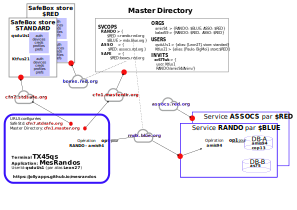

Le fonctionnement d'une **application réactive** fait intervenir plusieurs éléments logiciels décrits dans le chapitre ci-après.

# Vue générale

### Les "applications"
Les utilisateurs peuvent exécuter une **application** sur un de leurs _appareils / terminaux_ munis d'un moyen de communication avec un humain (écran, clavier, souris ...). Selon la variante technique choisie, un utilisateur lance une application portant un nom (comme `monAppli`):
- soit dans un browser _en ouvrant la page Web_ de l'application: l'URL désigne où le logiciel de l'application est stocké.
- soit _en l'installant_ sur un de ses appareils depuis un _magasin d'applications_ puis en la lançant.

> Sur un terminal donné, l'application `monAppli` est ou n'est pas en exécution, il n'est pas possible d'en lancer plusieurs simultanément.

### Les "services" de traitement des données
Un **service**:
- porte un nom qui qualifie synthétiquement son _objet / fonctionnalité_.
- il supporte plusieurs **opérations**: il correspond à un logiciel qui peut être déployé par un ou plusieurs _opérateurs_.
- les opérations sont demandées par une application en citant l'URL qu'un opérateur a utilisée pour déployer le service. Une opération,
  - reçoit en entrée des paramètres, 
  - effectue le traitement demandé, 
  - retourne un résultat qui en général va influer sur l'affichage de l'application l'ayant sollicitée.

En première approche lorsqu'une opération d'un **service** (déployé par un _opérateur_) est invoquée, un **programme** démarre _quelque part sur Internet_, exécute le traitement demandé puis s'arrête.

Si logiquement ceci est perçu comme tel vu de l'extérieur, le scénario _technique_ est un peu différent:
- au lieu de se terminer après la fin de l'opération, le programme reste _vivant_ en attendant qu'une autre opération soit demandée afin que l'énergie de calcul dépensée pour le chargement du programme soit _amortie_ sur un plus grand nombre d'opérations.
- le programme de plus est capable de traiter plusieurs opérations en parallèle.
- de facto le programme ne s'arrête que quand aucune demande d'opérations n'est parvenue _pendant un certain temps_.
- si le service est très sollicité, plusieurs programmes peuvent être lancés, sur des calculateurs différents le cas échéant, afin d'écouler le trafic des demandes d'opérations.

> Le temps au bout duquel un programme de traitement du service s'arrête en l'absence de trafic est un des paramètres de configuration de l'installation du service, de même que le nombre maximal de programmes s'exécutant en parallèle. 

> Certaines configurations peuvent fixer un nombre fixe de ces exécutions et spécifier que les programmes ne s'arrêtent pas même en l'absence de trafic: les choix résultent d'une valorisation économique dépendant des tarifs des fournisseurs de traitements à distance.

> UNE **application** donnée, par exemple `monAppli`, peut faire appel à plusieurs **services**, par exemple `assocs` et `rando`. Une application qui ne fait appel à aucun service a un comportement de _calculette_ et n'utilise aucune donnée externe.

### La "base de donnée d'un service", sa partition par "organisation"
En première approche un **service** déployé (`rando` par exemple) a **SA** base de données (`DB-A` par exemple): deux services différents ne partagent pas une même base.

La base de données est **partitionnée** par **organisation**:
- Les données relatives à une organisation `amis94` sont totalement disjointes de celles de l'organisation `balad59` mais la structure des données est unique.
- **une opération d'un service est strictement spécifique à UNE organisation** et n'accède dans la base de données qu'aux données de celle-ci.

> Ce dispositif _multi-tenant_ rend possible d'ajouter une nouvelle organisation sans interruption des services (même ceux en cours d'exécution).

Toutefois, ce mécanisme peut conduire à avoir une base de données trop volumineuse quand un grand nombre d'organisations sont supportées. Pour éviter ce problème, un **service** peut accéder à plusieurs bases de données, chaque organisation étant _hébergée_ dans une de ces bases (et une seule).

> Vu de l'extérieur c'est _comme si_ il n'y avait qu'une base unique et même c'est _comme si_ celle-ci était dédiée à l'organisation spécifiée en paramètre de chaque opération du service.

> **L'intégration des données provenant de plusieurs services** se fait au niveau des applications. Par clarté de conception mais surtout parce qu'invoquer une opération demande des _credentials_ cryptés qui ne sont détenus que par les applications mais jamais par les services.

> L'intégration des données provenant de plusieurs organisations pour un service donné se fait au niveau des applications: une _opération_ ne traite qu'une organisation.

### Le "storage de fichiers d'un service", sa partition par "organisation"
Un _storage_ a une structure qui s'apparente à un _file-system_.
- le stockage d'un _fichier_ (contenu binaire crypté) se fait en une opération atomique,
- le stockage de plusieurs fichiers ne fait pas l'objet d'un commit de type ACID (chacun peut ou non avoir été mis à jour).

Le _storage_ est également partitionné par _organisation_.

Comme pour une base de données, au cas où le volume l'exigerait, plusieurs _storage_ peuvent exister, chacun avec sa propre technologie le cas échéant.

> Un _storage_ n'est pas non plus partagé par plusieurs _services_.

> Un storage permet de mémoriser des volumes considérables de données,
>- peu ou pas mises à jour après stockage,
>- dont le contenu est en général _opaque_ pour les services (mais ce n'est pas obligatoire),
>- adapté à l'archivage de données de _legacy_.

### Les "Utilisateurs" et leurs _pouvoirs / credentials_ 
Les **utilisateurs** sont identifiés par un identifiant aléatoire et anonyme, sans référence avec des identifiants personnels dans la _vraie_ vie.

Depuis un appareil quelconque un utilisateur peut lancer une application dès lors qu'il en connaît l'URL. Celle-ci peut invoquer des **services** et leurs opérations MAIS toute opération exige en général que l'utilisateur exhibe un ou des _pouvoirs_ appropriés pour l'opération demandée et ses paramètres.

Par exemple une opération d'accès aux données d'un `adhérent` identifié `abcd` va exiger que l'application communique à l'opération un _jeton_ qui prouve que l'utilisateur dispose du pouvoir d'accéder aux données de cet adhérent. Le _pouvoir_ requis peut être différent selon que l'opération effectue une lecture ou une mise à jour de l'adhérent.

Un _pouvoir_ comporte deux parties:
- **une partie conservée par l'utilisateur** dont le texte comporte les éléments cryptographiques lui permettant de _signer_ chaque jeton attaché à une demande d'une opération.
- **une partie conservée dans la base de données du service pour l'organisation souhaitée** qui permet à l'opération de _vérifier_ que le jeton reçu en paramètre de l'opération est effectivement valide et contient bien les données qu'il prétend détenir, bref que l'utilisateur détient bien le _pouvoir_ qu'il prétend avoir.

Ce mécanisme détaillé par ailleurs permet,
- de ne pas stocker dans la base de données les éléments de _signature_,
- de pouvoir refuser des _jetons usurpés_, c'est à dire ayant déjà été présentés une fois et représentés plus tard.

### _Safe Box_ d'un utilisateur
Chaque _pouvoir_ est un texte long, comportant des données d'apparence aléatoire, bref impossibles à mémoriser (et à inventer par _force brute_). 

L'utilisateur pourrait certes disposer d'un fichier personnel où il les rangerait mais la sécurité et l'accès depuis plusieurs terminaux à ce fichier exposerait ces données de sécurité _critiques_ aux pertes et aux vols.

Chaque utilisateur dispose à cet effet d'une _Safe Box_ personnelle où ses pouvoirs sont rangés, cryptés et sécurisés. 

La _Safe Box_ d'un utilisateur a pour identifiant celui de l'utilisateur (ou à  l'inverse un utilisateur est identifié par le numéro de sa Safe Box). Il comporte plusieurs _rubriques_:
- son **entête** qui détient les éléments cryptographiques techniques nécessaires à son fonctionnement.
- la **liste de ses pouvoirs**.
- une **liste de terminaux certifiés de confiance**, c'est à dire des terminaux d'où il pourra s'identifier par un code PIN plus simple que son identification _forte_ et sur lesquels chaque application pourra laisser des _documents en mémoire cache_ locale cryptée permettant un usage en _mode avion_.
- une **liste de préférences** de comportement et d'affichage de son choix afin de retrouver en lançant une nouvelle session, l'organisation de l'écran qu'il souhaite, les options de son choix, sa langue de travail, etc.
- une **liste des profils de sessions favorites**, un profil ouvrant une session avec une liste de pouvoirs réduite à ceux requis pour couvrir un but spécifique. 

#### Dépôts des Safe Box: _standard_ ou _opérateur spécifique_
Un **dépôt _standard_** est géré: tout utilisateur peut en disposer pour y déposer sa Safe Box.

Mais les utilisateurs peuvent préférer confier leurs données de sécurité à un _opérateur_ en qui ils ont confiance (voire être eux-mêmes ou pour un groupe d'entre eux leur propre opérateur). 

Chaque utilisateur (ou groupes d'utilisateurs) peut déployer son propre dépôt de _Safe Box_ par exemple dans une base de données MySQL d'un site Web de son choix (et sous son entière responsabilité d'administration). Un exemple d'un script PHP est fourni: n'importe qui peut lire le texte et s'assurer de sa non nocivité. Mais l'opérateur choisi peut avoir le sien

Des moyens sont données pour basculer du dépôt _standard_ vers un _dépôt spécifique_ (et réciproquement), ainsi que pour effectuer des _backup_: l'image d'une _Safe Box_ peut être exportée cryptée par une clé détenue par le seul utilisateur.

> Le _contenu_ d'une Safe Box est lisible _en clair_ **pour son propriétaire et seulement lui**, ... mais étant plein de données cryptographiques le terme _en clair_ est un peu une vue de l'esprit.

### Exécution d'une application en _mode AVION_
Quand un utilisateur a certifié un ou des terminaux **de confiance** et qu'il y ouvre une session d'une application, celle-ci peut utiliser une **mémoire cache de documents et fichiers**, cryptée et sécurisée sur le terminal.

Depuis ce même terminal, l'utilisateur peut rouvrir une session qui s'est antérieurement exécutée sur ce terminal, elle y a été _épinglée_:
- s'il a accès au réseau Internet, le lancement sera rapide du fait que beaucoup de documents n'auront pas à être redemandés aux services, étant déjà _en cache_ (cryptés) dans le terminal.
- s'il n'a pas accès au réseau Internet il peut rouvrir son application en **mode AVION** et accéder (en lecture seulement) aux documents disponibles en cache du terminal du fait d'une exécution antérieure.

### Synthèse
Les **applications** s'exécutent sur le terminal de l'utilisateur où elles ont été chargées depuis leur URL (ou un magasin d'applications).

Elles font appel à des **services de traitement des données** distants, chacun ayant un jeu **d'opérations** pouvant lire / écrire SA **base de données** (éventuellement SES bases en cas de volume excessif) et SON **storage de fichiers** (éventuellement SES) partitionnés par **organisation**.

Chaque requête à une opération est dédiée à UNE organisation et n'accède qu'à la partition de la base de données dédiée à cette organisation et / ou du storage dédié à cette organisation.

Tout **utilisateur** dispose d'une **Safe Box** détenant en particulier ses _pouvoirs_ requis à l'appel des opérations des services par une application. Un utilisateur peut décider de confier la gestion de SA Safe Box, soit au **dépôt standard**, soit à un **dépôt spécifique** géré par l'opérateur de son choix.

# Installation des applications sur un _terminal_

Un PC, une tablette, un mobile sont des _appareils / terminaux_ munis d'un moyen de communication avec un humain (écran, clavier, souris ...).

Selon la variante technique choisie, un utilisateur démarre une application:
- soit dans un browser _en ouvrant la page Web_ de l'application.
- soit _en l'installant_ sur un de ses appareils puis en la lançant.

### Application de type Web : PWA _Progressive Web Application_
Depuis un browser l'utilisateur appelle une URL d'un _magasin d'applications_ qui ouvre la page d'accueil de l'application:
- l'application peut être directement utilisable depuis cette page.
  - L'utilisateur peut déclarer un _raccourci sur son bureau_ ou dans son browser vers cette URL afin d'éviter la ressaisie de celle-ci. 
  - Certains OS (comme iOS) des appareils ne permettent pas une utilisation directe d'une telle page Web et oblige à une _installation_, au demeurant simple, de l'application depuis cette page.
- l'application _peut ou doit_ selon le browser utilisé et l'OS de l'appareil, être _installée_ par le browser. Elle apparaît ensuite comme une application locale de l'appareil avec une icône de lancement, typiquement sur le bureau.

Le changement de version d'une application PWA est automatique, la vérification d'existence et le téléchargement d'une nouvelle version intervenant au lancement: l'utilisateur est convié à appuyer sur un bouton pour redémarrer celle-ci après installation de la nouvelle version.

> Un site comme `github.io` peut être utilisé comme _magasin d'applications_ Web-PWA: la mise en ligne d'un logiciel sur ce site est simple et gratuite, de même que la mise en ligne de sa documentation / aide en ligne.

### Application de type _mobile_
L'utilisateur l'installe depuis le ou un des magasins d'application supportés par l'OS du mobile.

Le changement de version est en général automatique mais peut être opéré manuellement.

> Il n'y a ensuite quasiment pas de différence perceptible par l'utilisateur à l'utilisation de l'application, il clique sur une icône pour l'ouvrir (la lancer).

> On peut installer une application Web-PWA sur un mobile: elle est ci-après considérée comme application PWA (et non comme _mobile_).

# Services dans le _cloud_

Les applications en exécution sur leur appareil envoient des requêtes à des **services _cloud_**, chacune consistant à invoquer une opération de consultation et/ou de mise à jour des données de l'application dans la base de données ou le storage de fichiers du service.

Un _service_ est techniquement déployé selon des variantes techniques non perceptibles de l'extérieur:
- **Serveurs permanents**: plusieurs processus sont en exécution en permanence afin de traiter les requêtes qui leur parviennent sur l'URL du pool de processus et ont été routées vers l'un ou l'autre.
- **Cloud Functions**: un _serveur éphémère_ du _Cloud_ est lancé pour traiter une demande de service reçue sur son URL:
  - la demande est traitée et le serveur éphémère reste actif un certain temps pour traiter d'autres demandes. Un serveur éphémère peut traiter plusieurs dizaines de demandes en parallèle.
  - en l'absence de nouvelles demandes, un serveur éphémère reste en attente, entre 3 et 60 minutes pour fixer les idées, puis s'interrompt.
  - si le flux des demandes sature la capacité d'un serveur éphémère, une deuxième instance, voire une troisième etc. sont lancées.

> Ces choix de déploiement technique ne sont pas détectables par les applications terminales qui sollicitent des _services_.

## Développement du logiciel (éditeur) et ses déploiements (par les opérateurs)
Un _service_ correspond à un logiciel qui a été développé par un **éditeur** en vue d'assurer une **finalité applicative** bien délimitée comme par exemple:
- le service `circuitscourts` : gestion de prises de commandes entre des producteurs et des consommateurs.
- le service `discussions` : gestion de groupes de partage de documents et d'échanges interactifs.
- le service `randos` : proposition de randonnées, inscription, échanges, etc.
- le service `boutiques` : gestion du catalogue d'une boutique, de son stock, etc.

Un ou des opérateurs de _déploiement_ peuvent installer / _déployer_ ce logiciel sur le _cloud_ et le rendre accessible pour les sollicitations des applications. Un même service logiciel peut avoir par exemple deux _déploiements_ **Rouge** et **Bleu**, 
- **Rouge** peut proposer `randos` et `discussions`,
- **Bleu** peut proposer `circuitscourts` et `randos`.

Les déploiements du logiciel `randos` par **Rouge** et **Bleu** ont chacun leur URL d'accès et peuvent différer en _prix_ et _qualité_ d'usage: temps de réponse, disponibilité, restrictions de volume...

## Organisations: services _multi-tenant_
Un service comme `randos`, peut à la manière de Discord, héberger les applications d'associations de randonneurs distinctes: chaque organisation / _tenant_ dispose de _son_ espace de données propre complètement étanche à celui des autres.

Un service `boutiques` propose de gérer plusieurs boutiques, mais de manière à ce que les données de chacune soient totalement isolées de celle des autres.

Les données d'un service d'un opérateur sont stockées dans deux _mémoires persistantes_:
- **UNE base de données** logiquement **strictement partitionnée par organisation**, sans aucun lien ou référence à des données / documents d'une organisation par une autre.
- **UN _storage_ de fichiers**, comme un directory de fichiers classiques, avec une **racine** par organisation.

> Une organisation peut _migrer_ d'un déploiement à un autre: ce transfert technique des données est génériquement possible, contractuellement c'est une autre affaire.

**Synthèse**
- un _service_ peut avoir plusieurs _déploiements_, chacun identifié par un code lui-même associé à une URL.
- une organisation donnée est hébergée pour un service donné par un _déploiement_.

> En conséquence il y a N organisations hébergées par déploiement d'un service.

## Applications / services

> Un service **Master Directory** a dans sa base de données une petite table `ZZSVCOPS` ayant une ligne par _service_ qui donne la liste des déploiements proposant ce service avec l'URL d'accès correspondante.

Une **application déployée** dispose dans sa configuration de l'URL d'accès à **Master Directory** ce qui lui permet d'obtenir pour le service `randos` par exemple les URLS pour les déploiements **Rouge** ou **Bleu**.

Un utilisateur _terminal_ a les moyens techniques de vérifier que l'application déployée qu'il entend utiliser,
- correspond bien au logiciel _officiel_ (et non pirate) mis en ligne en _source_ par son _éditeur_: sa version a pu être certifiée par une autorité de sécurité indépendante.
- accède bien aux _opérateurs officiels_ prévus et non à des sites pirates.

> Il est possible d'accorder sa confiance à une application déployée d'un éditeur la rendant accessible en _open source_ parce qu'il est possible à une entité de certification externe à l'éditeur de vérifier la conformité de ses déploiements.

## Une application terminale peut accéder à plus d'une organisation
> La table `ZZORGS` du _Master Directory_ dispose d'une ligne par _organisation_ donnant _pour chaque service_ le code du déploiement choisi par l'organisation.

Dans le cas de l'application `randos`, un utilisateur peut être membre de plus d'une association de randonneurs: une pour ses randonnées près de chez lui, une autre pour les randonnées de montagne et une troisième pour les treks lointains. Depuis la même application il peut basculer d'une organisation à une autre (le cas échéant avoir des vues les globalisant).

Un gestionnaire de boutiques peut par exemple gérer trois boutiques différentes (trois organisations) avec des rôles différents pour chacune.

Les utilisateurs de Discord accèdent souvent à plusieurs _serveurs_ qui s'ignorent entre eux, ayant des sujets d'intérêt totalement différents.

L'utilisateur qui ouvre sur son terminal son application `randos` peut disposer de pages de synthèse lui montrant ce qui est important pour chacune des associations auxquelles il participe. Pour agir effectivement sur l'une d'entre elles, il sélectionnera celle souhaitée et ses actions de mises à jour ne porteront que sur celle-là.

# Exécution d'une application sur un terminal
Sur un terminal donné, pour une une application donnée, une seule exécution peut être active à un instant donné, par exemple une seule application `randos`.

> Dans le cas d'une application Web-PWA, chaque browser (Firefox, Chrome ...) est vu comme un **terminal différent**: on peut avoir s'exécutant au même instant sur son PC, une même application sous Firefox ET sous Chrome (comme si on avait deux mobiles).

**Une application sur UN terminal** peut avoir trois états:
- être en exécution au **premier plan**. Sa fenêtre est affichée et a le _focus_, elle capte les actions de la souris ou du clavier. Pour un mobile c'est celle (ou l'une des deux ?) visible.
- être en exécution en **arrière plan** : elle a été lancée mais est recouverte par d'autres.
  - sur un browser, c'est un autre onglet qui a le focus ou la fenêtre du browser est en icône: l'utilisateur peut cliquer sur son onglet pour l'amener au premier plan ou sur l'icône du browser dans la barre d'icônes pour l'afficher.
  - sur un mobile elle est cachée mais peut être ramenée au premier plan quand l'utilisateur la choisit dans sa liste des applications _ouvertes mais cachées_.
- être **non lancée**: son exécution n'a pas encore été demandée (ou a été active puis fermée).

### Une application peut _envoyer_ des requêtes aux services
C'est l'application qui appelle par son URL un service qui **traite la requête et retourne un résultat**.
- requêtes et réponses peuvent être volumineuses.

### Une application peut _écouter_ des notifications émises par les services
Une application donnée sur un appareil donné est identifiée par un _jeton_ qui est une sorte de numéro de téléphone universel: tout service ayant connaissance de ce jeton peut envoyer des _notifications_ à l'application correspondante sur le terminal correspondant.

Une notification ressemble à un SMS:
- son texte est _court_ (certes plus long que celui d'un SMS).
- on ne répond pas à une notification: le service émetteur ne sait rien de la suite donnée, ou non, par l'application destinataire.

> L'application _peut_ en tenir compte et effectuer des traitements et des requêtes ultérieures aux services.

**Quand l'application destinatrice d'une notification est au PREMIER PLAN:**
- elle _peut_ afficher un court message dans une petite fenêtre _popup_ (voire émettre un son ...) pour alerter l'utilisateur,
- elle _peut_ et généralement va, effectuer le traitement adapté aux données portées par la notification.

**Quand l'application destinatrice est en ARRIÈRE PLAN:**
- elle _peut_ (ou l'OS de l'appareil ou le browser dans lequel elle s'exécute) afficher en _popup_ la notification ce qui alerte l'utilisateur,
- si l'utilisateur clique sur cette _popup_, l'application correspondante repasse au premier plan.

**Quand l'application destinatrice N'EST PAS en exécution:**
- l'OS de l'appareil ou le browser dans lequel elle est enregistrée, _peut_ selon que l'utilisateur l'autorise ou non, afficher en _popup_ la notification ce qui alerte l'utilisateur,
- si l'utilisateur clique sur cette _popup_, l'application est lancée.

## Des applications _écoutantes_ réagissant au flux d'informations poussées
Les applications **sourdes** classiques ne peuvent afficher des écrans que sur sollicitation de l'utilisateur. 

L'écran ne se remet à jour que suite à une action de l'utilisateur: si ce dernier ne fait rien, l'écran ne change pas et affiche des données plus ou moins anciennes qui ont pu être déjà modifiées par l'action d'autres utilisateurs, du temps qui passe, etc.

Les applications **écoutantes** peuvent remettre à jour leurs écrans et données détenues localement même sans action d'un utilisateur simplement en fonction des _notifications_ poussées vers elles par les serveurs. Elles _peuvent_ rester à l'écoute (même non lancée) et l'utilisateur peut, à réception d'une notification, rouvrir l'application d'un clic.

# Les stockages des données

Pour un _service donné_ assuré par un opérateur donné il existe deux stockages dédiés:
- une base de données,
- un _storage_ de fichiers.

Les stockages sont _partitionnés_ par _organisation_, une partition pour chaque organisation hébergée par ce service.

## La base de données
Elle gère les documents selon un mode _transactionnel_ (ACID).

Elle gère aussi les _abonnements_ des applications terminales aux _documents (synchronisables)_ qui les intéressent, chaque application sur un appareil ayant un _token_ qui l'identifie de manière unique. 

> Sur un terminal _certifié de confiance_ par un utilisateur, une _micro base de données locale_ pour chaque session d'application _épinglée_ détient en _cache_ les _documents_ récemment demandés et les _abonnements_ en cours de l'application. 

Quand un ou des documents évoluent par exécution d'une opération, celle-ci retrouve toutes les applications terminales abonnées et effectue une publication de notifications vers elles.

> Chaque application terminale est en conséquence susceptible de s'abonner éventuellement auprès de plusieurs services, y compris si toutes les organisations de son domaine d'intérêt sont gérées par des opérateurs différents.

### SINGLETONS de configuration
Un SINGLETON de configuration d'un _déploiement_ est une table à deux colonnes `key / value`:
- `key`: code définissant l'item de configuration.
- `value`: un texte JSON.

Certains SINGLETONS sont,
- chargés à l'initialisation: les requêtes parvenant à cette phase sont le cas échéant _temporisées_ jusqu'à la fin du chargement.
- rafraîchis quand ils sont trop vieux mais en tâche de fond: les requêtes n'attendent pas et travaillent avec une ancienne version le cas échéant.

Ils peuvent donc être _mis en service_ sans interruption du service, mais avec un certain délai de prise en compte. Même un grand débit de requêtes ne souffrent pas de ce délai.

Les autres sont chargés sur demande d'une opération et conservés en _cache_, n'étant rechargés que quand leur version est trop ancienne.

### Documents d'une organisation
Pour un _service déployé_ et pour une _organisation_ donnée les documents sont regroupés par _classes_ :
- certaines n'ont structurellement qu'un seul qu'un document dont la _primary key_ est arbitrairement fixée à `1`.
- la plupart ont N documents, chacun ayant une _primary key_ `pk` calculée depuis certaines propriétés invariantes de la classe du document `p1 / p2 / p3`.
  - `pk`  peut être, soit directement ce _path_, soit son hash.
  - _exemple_: classe `Auteur` avec un document par auteur indiquant quelle `Section` du comité de rédaction le supervise.

Les _documents_ ont un _path universel_ `svc / org / docCl / docPk` où,
- `svc` est le code du service,
- `org` celui de l'organisation,
- `docCl` est le code de la classe des documents,
- `docPk` est la _primary key_ identifiante du document.

> Sachant dans quel _déploiement_ une organisation est hébergée pour un service donné, au couple svc / org il correspond une URL localisant ses documents.

**Le contenu d'un document est un objet sérialisé** dont la structure dépend de la classe du document.

Pour un _service déployé_ donné, les données sont donc structurées logiquement ainsi:
- `org` : organisation propriétaire du document.
- `docCl` : classe du document.
- `pk` : clé primaire identifiante.
- `v` : version, date-heure (_epoch_) de l'opération l'ayant changé pour la dernière fois.
- `data` : sérialisation du contenu du _document_.

> La lecture d'un document dans une opération ramène la version la plus récente. Quand celle-ci a été obtenue d'un cache, le mécanisme ACID de l'opération garantit qu'il n'y a pas une autre version plus récente.

Toutefois il est possible d'obtenir un document de version moins récente, bref de ne pas s'assurer qu'il n'en n'existe pas un plus récent:
- ceci évite des accès inutiles en utilisant intensivement le _cache_,
- mais ceci interdit de mettre à jour le document ainsi lu.

Par exemple la classe Status qui renseigne sur la disponibilité du service pour une organisation permet dans les opérations même à très haut débit de _vérifier_ le status à condition d'accepter un léger différé dans la fraîcheur de cette information (ce qui est le cas).

#### Pour un _service déployé_, l'organisation _abstraite_ `A`
Par convention elle détient des documents qui ne sont pas spécifiques d'une organisation mais sont communs à toutes. Par exemple:
- `A/$Status/1`: indique l'état de disponibilité **du déploiement** _ouvert / fermé_ avec éventuellement un message d'information de l'administrateur technique.
- `org/$Status/1` indique l'état de disponibilité **pour l'organisation `org`** _ouvert, lecture seulement, fermé_ et éventuellement un message d'information de l'administrateur technique.

### Classes _virtuelles_
**Elles n'ont pas de _contenu_** et peuvent être des singletons ou non. Elles définissent un espace de noms `docCl/docPk` d'une organisation.
- elles sont déclarées comme les classes réelles dans le schéma de l'application avec un nom, le flag `virtual` et ou non le flag `singleton`.

Une classe virtuelle **singleton** n'a pour convention qu'une _primary key_ de `1`.
- `CoDir/1` : un singleton (virtuel) représentant le _comité de direction_.
- `Redaction/1` : un singleton (virtuel) représentant le _comité de rédaction_.

Une classe virtuelle **multivaluée** est déclarée avec la liste énumérée de ses _primary keys_:
- `Section` : classe multivaluée, a une liste fermée de _pk_ `roman histoire science`.

Les `pk` sont citées par une liste exhaustive de _codes_, qui de ce fait _peuvent_ le cas échéant avoir une traduction en session d'application. La liste est donnée:
- **soit directement dans la déclaration de la classe virtuelle**: elle est très stable, courte, modifiable par redéploiement du service par les opérateurs qui l'assure.
- **soit par la valeur d'un SINGLETON de configuration**: la liste peut être plus longue et peut être mise à jour sans interrompre le service et le redéployer.

Dans le schema statique qui décrit les classes de documents, si le nom du SINGLETON de configuration se termine par `_`, le code de l'organisation `org` de l'opération est ajouté à la fin pour donner le nom effectif du SINGLETON.

> Une classe _virtuelle_ gère ainsi de facto une _énumération_ de codes susceptible d'évoluer dynamiquement sans redéploiement. En revanche les _traductions_ étant statiquement déclarées dans les applications, il n'y a pas obligatoirement un _libellé_ traduit pour chaque code.

## Le _Storage_ de fichiers 
Il stocke des _fichiers_ identifiés par leur _path_: la présence de caractères `/` dans un path définit une sorte d'arborescence. Le _contenu_ de chaque fichier est une suite d'octets opaque.

En lui-même il n'est pas soumis à un protocole transactionnel (ACID): sa sécurité transactionnelle est déportée sur la base de données avec un protocole simple à deux phases. Le couple base de données / storage permet de garantir qu'un fichier existe ou non, de manière atomique.

Le Storage permet de disposer d'un volume pratiquement 10 fois plus important à coût identique par rapport à la base de données: de nombreuses applications ont des données historiques / mortes ou d'évolutions sporadiques qui s’accommodent bien d'un support sur Storage.

# Autres notes associées

### _[Documents et fichiers, souscriptions et synchronisations"](tech/Documents.html)_

### _[Utilisateurs et leur 'Safe Box'"](tech/Safe.html)_

# Services, déploiements, organisations, opérations, credentials
### Service
Définit une liste d'opérations qui peuvent être invoquées avec leurs signatures.
- code `SVC` : majuscule + 2 à 7 majuscules / chiffres : `AS2`

### Déploiement par un Opérateur
Un opérateur fournit des prestations de calcul / stockage de données pour plusieurs services.
- code du déploiement `$OP`: $ + 2 à 7 majuscules / chiffres : `$RED1`
- **chaque service supporté a son URL**.
- l'URL d'un `service déployé` peut changer.

### Organisation
Une organisation dispose de ses propres données regroupées par **service**.
- son code `org`: minuscule + 2 à 15 minuscules / chiffres: `test demo amis94`
- pour chaque **service** elle a choisi UN **opérateur**. 
- l'opérateur d'un `organisation service` peut changer.

Un `service déployé`(une URL) dispose d'un `SINGLETONS` de clé primaire `orgs` donnant _pour chaque organisation_ le couple des codes de la base de données et du storage hébergeant ses données.

    { "demo": ["sqlite_A", "storage_a"], "amis94": [...] }

### Opérations standard
L'identifiant complet d'une opération est le couple _service opération_.
- le code d'une opération est un nom de classe.
- elle est invoquée par l'URL du `service déployé` avec son **code d'opération** `opName` (relatif à son service).

Un **code organisation** `org` figure en argument de l'opération qui est dédiée à une seule organisation.

### Opérations d'administration d'un service déployé
Son URL est celle de son `service déployé` avec:
- son **code d'opération** (relatif à son service) se termine par `$` ce qui permet d'ouvrir la base de données par défaut du service (et non celle associée à l'organisation),
- le code du déploiement `$OP`.

## Le directory central _MASTER DIRECTORY_
Il est hébergé dans la base de données d'un déploiement dont l'URL est donnée dans la configuration statique de chaque application.

Comme pour le store _générique_ des _Safe Box_, il n'y a qu'un seul _MASTER DIRECTORY_ de production.

> Il peut y avoir autant de MASTER DIRECTORY de test que souhaité par les développeurs pouvant ainsi disposer chacun d'environnements totalement privatifs.

### Tables: `ZZSVCOPS ZZORGS ZZUSERS ZZEVENTS`

#### Table `ZZSVCOPS`
- `key` : clé primaire, le code d'un service.
- `v` : _epoch_ en secondes de mise à jour.
- `value`: un texte JSON donnant pour chaque opérateur son URL:

    {
    "RANDO" : { 
      "$RED": { "url": "https://..."}, 
      "$BLUE": { "url": "https:// ..."}
    },
    "ASSOCS": {}
    }

#### Table `ZZORGS`
- `key` : clé primaire, le code d'une organisation.
- `v` : _epoch_ en secondes de mise à jour.
- `value`: un texte JSON donnant pour chaque service le code de l'opérateur qui l'assure:

    {
      "amis94": { "RANDO": "$BLUE", "ASSOCS": "$RED" },
      "balad59": { "RANDO": "$BLUE", "ASSOCS": "$RED" },
    }

#### Table `ZZUSERS` 
Une ligne est déclarée pour chaque utilisateur à l'occasion de la création de sa Safe Box:
- `userId`: clé primaire.
- `hshk`: hash du Strong Hash de sa clé K, servant à vérifier sur certaines opérations que le demandeur est bien propriétaire de la Safe Box d'ID userId.
- `hsha1`: hash du Strong Hash de l'alias 1 de l'utilisateur.
- `hsha2`: hash du Strong Hash de l'alias 2 de l'utilisateur.
- `C` : clé publique de cryptage.
- `V` : clé publique de vérification de signature.
- `llq`: dernier trimestre d'accès à la Safe Box.
- `store`: code de l'opérateur gérant la Safe Box si ce n'est pas l'opérateur générique.

    {
      "qzFuser1...": { "alias": ["Leon27...", ""], "store": ""},
      "9Kvuser2...": { "alias": ["Paulo...", "BigMoi"], "store": "$RED"},
    }

Les objectifs de cette table sont les suivants:
- fournir le `userId` et le `store` d'un utilisateur depuis un des deux alias qu'il a déclaré.
  - lors du login de l'utilisateur pour lui permettre _d'ouvrir_ sa Safe Box (après avoir fourni sa phrase secrète d'ouverture).
  - pour un utilisateur _sponsor_ d'obtenir le userId d'un utilisateur dont il connaît un alias.
- fournir aux services les clés publiques de cryptage et de vérification de signature d'un utilisateur.
- accessoirement, déterminer les utilisateurs inactifs depuis un certain temps et lancer des _garbage collectors_.

#### Table `ZZEVENTS`
Elle est détaillée plus avant dans ce document.

#### Table `ZZSAFE`
Pour les utilisateurs dont la _Safe Box_ est hébergée dans le store _générique_ des Safe Box.
- `userId`: ID du propriétaire de la Safe Box.
- `llq` : numéro du dernier trimestre d'accès.
- `data` : contenu crypté de la Safe Box. Sections: `auth devices, creds profiles prefs`

    {
      "qzFuser1...": { auth:{}, devices:{}, creds:{}, profiles:{}, prefs:{} },
    }

## Schéma général : exemple

#### Scenario
##### Obtention de la _Safe Box_
- L'utilisateur d'alias `Leon27` ouvre l'application **MesRandos** qui se trouve hébergée sous _github.io_ à l'URL `https://jollyapps.github.io/mesrandos`
- Il saisit son alias `Leon27` :
  - l'application consulte le _Master Directory_ dont l'URL figure dans sa configuration: la réponse est tirée de `ZZUSERS` qui indique que l'alias `Leon27` est bien enregistré et correspond au userId `qsduUs1` dont la _Safe Box_ est hébergée par le _store_ `standard`.
- L'utilisateur saisit sa phrase secrète: le service _Safe Box standard_ vérifie que cette phrase secrète est bien celle enregistrée pour ce userId et le contenu de la Safe Box est copié dans la session de l'application.
- Dès lors `Leon27` peut utiliser l'application qui dispose de ses droits d'accès dans sa _Safe Box_.

##### Lancement d'une opération
L'application _MesRandos_ a besoin de solliciter une opération `op1` du service `RANDO` sachant que l'utilisateur a désigné son organisation `amis94` dans laquelle il a un droit d'accès `Animateur/wxfr`.
- l'application demande au _Master Directory_ l'URL du service déployé correspondant:
  - Dans `ZZORGS` il obtient que l'organisation `amis94` a son service `RANDO` hébergé dans le déploiement `$BLUE`.
  - Dans `ZZSVCOPS` il obtient que le service `RANDO` est assuré par le déploiement `$BLUE` à l'URL `rndx.blue.org`.
- l'application envoie donc sa requête à cette URL.
- une table locale au service dans base de données _maître_ indique que l'organisation `amis94` est gérée par la base de données `DB-A`.
- l'opération accède aux données / traitement demandé:
  - elle a vérifié que la session disposait bien du droit d'accès correspondant identifié `RANDO/amis94/Animateur/wxfr`.
  - la session a signé un jeton par sa clé de signature et le service a vérifié par la clé de vérification détenue dans DB-A que ce jeton était bien signé.

## Status

### Status d'un `service opérateur`
Un Administrateur d'un opérateur peut fermer / ouvrir séparément chacun des services déployés.

`A` désigne une _pseudo_ organisation dont les données ont une signification pour toutes les organisations.

Dans la base de données déclarée _de référence_ pour son URL, le document `A/Status/1` donne en JSON:

    { "at":1771588453502,"st":1,"txt":"hello world!" }

- `at` : date-heure (epoch) de dernière mise à jour du status.
- `st` : état du service. 9: DOWN, 1: UP
- `txt` : texte non crypté destiné à l'affichage informatif dans les applications.

### Status d'une organisation pour un `service déployé`
Un Administrateur d'un opérateur peut fermer / ouvrir séparément chaque **organisation** qu'il héberge pour chaque service déployé.

Le status d'une organisation est enregistré dans un document `org/Status/1`:

- `at` : date-heure (_epoch_) de dernière mise à jour du status.
- `st` : état du service. 9: DOWN, 1: UP, 2: READ-ONLY
- `txt` : texte non crypté destiné à l'affichage informatif dans les applications.

## Opérations d'Administration Technique
Tout utilisateur peut être reconnu _Administrateur Technique_ au déploiement d'un service par un opérateur: son ID est ajouté aux listes statiques de configuration:
- `MASTERDIRADMINUSERS` : pour le MASTER DIRECTORY,
- `ADMINUSERS` : pour les autres services déployés.

Lors du contrôle d'authentification à l'entrée d'une opération requérant un droit d'Administrateur, le `userId` du requérant est,
- certifié par vérification de la signature du _challenge_ par usage de la clé publique de vérification de cet utilisateur obtenu de la table `ZZUSERS`,
- par présence du `userId` dans,
  - la liste `ADMINUSERS` du déploiement d'UN service SVC / $OP.
  - la liste `MASTERDIRADMINUSERS` pour l'Administrateur du MASTER DIRECTORY.

### Liste des déploiement dont l'utilisateur est _administrateur_
Pour pouvoir afficher la page _Administration Technique_, un utilisateur doit auto-déclarer dans sa _Safe Box_ la liste des couples `SVC $OP` (services déployés) pour lesquels il a ce pouvoir:
- quand il en ajoute un, le fait qu'il le soit réellement est vérifié.
- si son `userId` est ensuite retiré de la configuration du _service déployé_, il doit remettre à jour cette liste.
- s'il ne s'inscrit pas de lui-même, de facto il ne peut pas atteindre la page d'administration.

> La révocation d'un Administrateur se fait en enlevant son ID de la liste `ADMINUSERS / MASTERDIRADMINUSERS` correspondante et en redéployant le logiciel.

## Depuis les _Outils Techniques >> Hot_
Après authentification ce dialogue propose plusieurs actions qui requièrent d'être reconnu comme Administrateur du _MASTER DIRECTORY_.

#### Déclaration de l'URL d'un service SVC de déploiement $OP
Cette opération créé / met à jour l'URL correspondante pour $OP dans la ligne SVC de la table `ZZSVCOPS`.

Ceci vaut _déclaration d'existence_ au couple `SVC / $OP`.

> Le service correspondant n'est pas pour autant _ouvert au trafic ou non_ ce qui est une décision de l'Administrateur du service / opérateur (et non de celui du _MASTER DIRECTORY_).

#### Activation / révocation d'une organisation `org` pour un `SVC / $OP`
Pour un service donné, une organisation est hébergée par un seul opérateur: c'est en conséquence une tâche d'Administration générale que d'assigner l'organisation pour chaque service à l'opérateur l'hébergeant. 

Le row `org` de la table `ZZORGS` est créé / mis à jour.

> L'accès à l'organisation correspondante n'est pas pour autant _ouvert au trafic ou non_ ce qui est une décision de l'Administrateur du service / opérateur (et non de celui du _MASTER DIRECTORY_).

## Depuis les _Outils Techniques >> Status des Services_
Après authentification ce dialogue propose plusieurs actions qui requièrent d'être reconnu comme Administrateur _DU service_ `SVC` pour le déploiement `$OP` cité.

#### Le status de SVC / $OP 
Il peut être mis à _UP ou DOWN_ et être accompagné d'un court texte informatif donné par l'Administrateur.
- les opérations sont bloquées quand le status est DOWN, SAUF celle qui modifie ce status et peut en conséquence le remettre UP et adapter l'information.

#### Le status d'une organisation org hébergée par SVC / $OP
Il peut être mis à _UP LECTURE-SEULE ou DOWN_ et être accompagné d'un court texte informatif donné par l'Administrateur.
- les opérations sont bloquées quand le status est DOWN, SAUF celle qui modifie ce status et peut en conséquence le remettre UP et adapter l'information.

#### La configuration d'une organisation org hébergée par SVC / $OP
Elle consiste à attacher l'organisation à,
- UNE des bases de données gérées par SVC / $OP,
- UN des _storage_ gérées par SVC / $OP,

> Cette configuration est déclarative seulement et ne correspond pas à un _transfert technique_ de base ou de storage, opérations lourdes gérées en ligne de commande par un administrateur système de l'opérateur.

> Au début d'une opération, un jeton émis par la session est vérifié, la signature du challenge par la clé de signature extraite de la _Safe Box_ est vérifiée par la clé de vérification détenue la DB du service. Mais le credential peut être marqué hors limite: la session n'en n'a pas été informée. 

# Credentials attachés à un document
Un credential est un pouvoir donné à _UN_ utilisateur d'accéder _AU_ document du credential:
- soit un document _réel_: `Auteur/VictorHugo`.
- soit un document _virtuel_: `Redaction/1` `Section/histoire` `Codir/1`.

> Pour un document donné, un utilisateur n'a au plus qu'UN credential.

**Le pouvoir exact** d'un _credential_ est exprimé par les propriétés de l'objet `props` du credential dont les valeurs contrôlent le comportement des opérations.
- quand elle existe la propriété `props.limit` donne une _epoch en minutes_ limite de validité du credential.

Un credential est stocké en deux exemplaires:
- **en tant que _document_** (ou objet dans son document) dans la DB du service / organisation.
- **en tant qu'objet dans la _Safe Box_** de l'utilisateur U propriétaire.

### Objet _embarqué_ vs document _dissocié_
Les données d'un credential identifié `credId` sont regroupées dans un objet `cred` qui peut être:
- soit _embarqué_ dans son document dont la propriété `creds` contient la liste des objets credentials qui lui sont relatifs.
- soit _dissocié_ dans un document séparé de classe `Credential`:
  - sa `pk` est le `credId` du credential.
  - le couple `docCl / docPk` du document du credential y est indexé.
  - le contenu du document est l'objet `cred`.

**Propriétés du _document_:**
- (`svc org` virtuellement).
- `credId` : identifiant universel du document.
- `docCl docPk`: identifiant _du_ document dont il gère les pouvoirs.
- `pubv pubc`: clés publiques de vérification et cryptage du _credential_.
- `props`: objet dont les valeurs règlent le détail du pouvoir de l'utilisateur U.
- `maxLife`: date-heure (_epoch_ en secondes) au delà de laquelle le credential est considéré comme _disparu_:
  - pendant la phase A de création maxLife est une date-heure de quelques secondes plus tardive que la date-heure de l'opération de création.
  - à la phase B de création maxLife est mise à la valeur définie par props.limit (ou 0).
  - une phase de création échouant à se conclure durant ce court délai mettrait le credential en création à l'état _disparu_.

**Propriétés de son entrée en _Safe Box_:**
Dans la section _credentials_ d'une Safe Box il y a une entrée par `credId` avec les propriétés suivantes:
- (`userId` virtuellement).
- `svc org`
- `credId`
- `docCl docPk`
- `privsK privdK`: clés _privées_ de signature / décryptage du credential cryptées par la clé K en base 64.
- `nameK`: _identifiant humainement lisible _ donné par U correspondant à `docPk`.

### Création d'un credential
La procédure, typiquement par utilisation d'un _form_, a obligatoirement une phase où une session de l'utilisateur U a pu:
- générer `credId privs/pubv privd/pubc`,
- saisir d'une manière ou d'une autre `name`,
- crypter par sa clé K `credK : { svc, org, docCl, docPk, privs privd }` et `nameK`,
- calculer `signId` la signature de `credId` par la clé de signature de U.

L'opération de création effectue:
- **Opération (A) phase 2 (ACID)** : l'enregistrement du document `{ credId, docCl, docPk, pubv, pubc, props, ttl }` avec un `ttl` très court.
- **en phase 3 (après commit)** : lancement immédiat d'une autre opération (B) qui:
  - enregistre le credential dans la _Safe Box_ de l'utilisateur par l'opération `sf.CredCreate` dans l'entrée correspondante `{ credId, credK, nameK, signId }`. La signature de `credId` en `signId` est vérifiée par l'opération afin d'éviter des créations par saturation (du moins pouvoir les ignorer).
  - recalcule ou met à 0 le `maxLife` du _document_.

### Autres opérations de la _Safe Box_
Le `name` (texte humainement compréhensible figurant docPk), crypté par la clé K de l'utilisateur peut être mis à jour.

L'utilisateur peut aussi détruire un de ses credentials.

> Toutes les propriétés d'un credential sont immuables SAUF, 
> - en _Safe Box_ la propriété `name` le sont dès passage à l'état valide,
> - dans le _document_ la propriété `props` qui peut être mise à jour par des opérations.

### Usage de `props` d'un credential
`props` ne peut être mis à jour **QUE** par une opération qui a été authentifiée et autorisée à le faire:
- elle peut être _lue_ par l'utilisateur U,
- U ne peut pas y intervenir directement et doit passer par une opération, bref U ne maîtrise pas lui-même son propre pouvoir exact.

`props.limit`
- par convention définit par une _epoch en secondes_ la date-heure limite de validité du credential.
- une opération peut mettre à jour cette valeurs.

`props.xxx`
- ces propriétés sont les paramètres utilisés par les opérations opérant sur le document (seuils, flags diverses, dates de valeurs, etc.).

##### Exemple: `props.dk1`
- `dk1` donne une _clé_ de cryptage AES à laquelle tous les utilisateurs ayant un credential sur le même document `docCl/docPk` peuvent accéder.
- sa valeur est cryptée par la clé AES générée depuis `privd_T / pubc_U` pour une opération sous authentification d'un tiers T: U et seulement U peut décrypter `dk1`.
- remarques: 
  - `dk1` _n'existe plus_ dès lors qu'il n'y a plus de credential sur le document `docCl/docPk`.
  - `dk1` ne peut être transmis _QUE_ par un utilisateur X ayant lui-même un credential sur le document `docCl/docPk` et ayant reçu dk1 d'un autre (ou l'ayant créé si c'est le premier)

##### Exemple: `props.aboutU`
- `aboutU` donne une information à propos de U, fixée par une opération authentifiée U (son nom / pseudo, carte de visite, etc.).
- `aboutU` est crypté par `dk1` qui est accessible dans le credential de chaque autre utilisateur sur le document `docCl/docPk`.

##### Clés et valeurs confidentielles réservées à U
Une propriété `secretX` peut contenir n'importe quelle valeur qui a été cryptée par la clé AES générée depuis `privd_T / pubc_U` pour une opération sous authentification d'un tiers T (ou U lui-même).

Ainsi les sessions de U bénéficient pour chaque _document_ sous contrôle d'un credential, de propriétés qui ne sont déchiffrables QUE par lui-même et restent _opaques_ aux opérations.

### Credentials _obsolètes_
A la création les copies _Safe Box_ et _document_ sont _normalement_ synchrones mais, la copie _Safe Box_ est écrite **après** la copie _document_: si un incident intervient entre ces deux étapes, le document s'auto-détruit très vite (sa `maxLife` est très proche de la date-heure de création) et en conséquence il reste en _Safe Box_ une copie _de facto déjà obsolète_ (et inutilisable).

Après création des opérations peuvent changer la propriété `props.limit`: ceci équivaut à une **suppression** du credential (_document_)quand la limite est dans le passé.

En conséquence dans une session d'application, un credential en _Safe Box_ peut exister alors que la copie _document_ a (définitivement) disparu.

> L'utilisateur peut révoquer n'importe lequel de ses credentials, en étant conscients des risques que cela entraîne en termes de pouvoirs de lecture et d'action.

## L'objet `AuthRecord` attaché à toute demande d'opération
Toute opération requérant la présence d'au moins un credential est sollicitée en passant en arguments un objet de classe `AuthRecord`, construit par l'application et ayant les propriétés suivantes:
- `sessionId`: identifiant de session.
- `time`: date-heure en seconde de création du record.
- _challenge_: propriété virtuelle _sessionId '/' time_
- Si l'utilisateur doit être authentifié en tant que tel:
  - `userId`: de l'utilisateur.
  - `userSign`: signature par la clé privée de signature de l'utilisateur, du _challenge_.
- `signatures`: objet ayant une propriété par `credId` de credential inscrit dans le record donnant la signature du challenge par la clé privée de signature du credential.

Au démarrage d'une opération, le `AuthRecord` joint est scanné:
- si la signature du `userId` est présente mais pas validée, c'est un échec.
- une map des  `[docCl docPk]` dont la signature a été vérifiée et validée est établie donne le couple [`credId`, `signature`]. `credId` permet à l'opération,
  - soit d'accéder à l'objet `cred` pointée par `credId` dans la map `creds` du document identifié par `docCl docPk`
  - soit, si la classe de documents n'embarque pas les credentials, d'accéder au document _credential_ correspondant et d'en lire l'objet `cred`,
  - depuis cet objet la clé de vérification permet de vérifier que le _challenge_ a été correctement signé.
  - l'objet `cred` est conservé dans le `AuthRecord` par l'opération et pourra être consulté à volonté par le traitement de l'opération pour décider ce qu'il peut / doit faire en fonction des paramètres inscrits dans `cred`.

> La liste des credentials en échec de vérification est également générée afin de documenter l'exception de rejet de l'opération associée.

> Une opération _peut_ requérir que l'utilisateur soit _authentifié_, voire qu'il soit inscrit comme _administrateur_ du service.

# _Chats_ entre utilisateurs disposant d'un credential sur un même document
La classe du document peut être _virtuelle_.

Les utilisateurs détenteurs d'un credential d'un document `docCl docPk` forment de facto un _groupe_ dont les membres peuvent se connaître les uns les autres typiquement par des propriétés comme,
- `props.aboutU` que chacun a dans son credential et qui peut être décryptée par les autres,
- par les autres propriétés de `props` dépendantes de la classe `docCl`.

> Ces utilisateurs ont donc une vision _explicite_ des autres: _nom, carte de visite avec photo, autres propriétés libres, etc_

Chaque credential disposant d'une clé _publique_ de cryptage `pubc`, il peut s'établir des _chats_ entre **DEUX** membres de ce groupe.

Soit deux credentials A et B ayant un chat entre eux. Tout item de chat écrit par A est dédoublé:
- une copie cryptée par A avec la clé de cryptage de B et stockée dans le credential B (dans `props.chat` par exemple).
- une copie cryptée par A avec sa propre clé publique de cryptage et stockée dans le credential de A.

> Un item peut être _multi-destinataire_: le même item est _envoyé_ N fois (comme des CC), l'expéditeur n'en ayant qu'une copie (et non N).

### Quelques règles:
- un item peut être marqué _important_ par son destinataire.
- le nombre d'items de chat par credential est limité.
- le volume total des items par credential est aussi limité.
- quand le volume est excessif, les plus anciens disparaissent en essayant de conserver ceux _importants_.
- **A dispose d'une liste noire**. Si B est en liste noire de A,
  - il n'a droit qu'à un item chez A (les précédents s'effacent),
  - cet item est limité en taille (50 signes),
  - il est marqué _liste noire_ et est prioritaire à l'effacement en cas d'excès de volume.
- **A peut à l'inverse exprimer une liste blanche**, tous ceux non cités sont en liste noire.

# Formulaires de _demande / proposition_
Un utilisateur U peut, selon la logique applicative, créer de son propre chef certains documents et s'en donner à lui-même le credential d'accès. Une opération peut effectuer ce traitement sur l'instant.

Mais dans bien des cas U a besoin de recourir à un _tiers_ ayant le pouvoir correspondant pour réaliser cette tâche:
- soit de création d'un document et d'obtention du credential associé,
- soit d'obtention d'un credential sur un document existant, virtuel ou réel.

Il doit engager un _processus_ non immédiat puisque faisant apparaître 2 interlocuteurs, U et un tiers T, ce dernier n'étant par principe pas disponible de manière synchronisée. De plus,
- T n'est pas obligé d'accepter la demande de U telle quelle et peut faire jouer son droit d'arbitrage humain _métier_,
- réciproquement U n'est pas obligé d'accepter les options prises par T et peut jouer de son droit à en négocier les termes, voire à renoncer à sa demande.

### Un processus en 4 états
**(A) Ouverture d'un formulaire par U:**
- U saisit les paramètres de sa demande, ses souhaits, et y joint un texte libre.
- le formulaire est créé en état (1).

**(B) Un tiers ayant les pouvoirs de traiter le formulaire** (qui est en état (1)) l'ouvre et:
- **soit** accepte les termes proposés par U:
  - l'opération correspondante de création de document / credential est exécutée. Le (ou les)credentials sont créés _en attente_ et ne seront effectivement activés qu'à l'occasion de la prochaine ouverture de session de U (voire sur l'instant si U est à l'écoute).
  - le formulaire passe en état (3) _traité avec succès_ et est archivé pendant quelque temps.
- **soit** n'accepte pas les termes proposés par U, les corrige et joint un texte libre. Le formulaire passe en état (2).

**(C) U rouvre son formulaire** (qui est en état (2)) et:
- **soit** en accepte les termes. 
  - l'opération correspondante est exécutée.
  - le formulaire passe en état (3) _traité avec succès_ et est archivé pendant quelque temps.
- **soit** en modifie les termes et y joint un texte libre.
  - le formulaire repasse en état (1) (T pourra alors s'en saisir à nouveau).
- **soit** renonce à sa demande.
  - le formulaire passe en état (4) _annulé_ et est archivé pendant quelque temps.

**(D) Variante du processus:** c'est T qui prend l'initiative de créer un formulaire en faisant une _proposition_:
- T saisit les paramètres de sa proposition et y joint un texte libre.
- le formulaire est créé en état (2) d'où U pourra s'en saisir (étape (C) ci-dessus).

Les états successifs d'un formulaire après sa création sont donc les suivants:
- (0) : état fugitif en mémoire _en création_.
- (1) : saisi / modifié par U en attente d'acceptation / modification par T.
- (2) : saisi / modifié par T en attente d'acceptation / modification par U.
- (3) : processus terminé avec succès, archivé un certain temps.
- (4) : processus annulé, archivé un certain temps.

**Variantes en cours de processus:**
- un formulaire en état (1) peut être repris par U avant que T ne s'en saisisse et,
  - modifié : reste en état (1).
  - rétabli tel que T l'avait proposé et accepté: passe en état (3).
  - annulé : passe en état (4).
- un formulaire en état (2) peut être repris par T avant que U ne s'en saisisse et,
  - modifié : reste en état (2).
  - rétabli tel que U l'avait proposé et accepté: passe en état (3).

## Types de formulaires
Il existe plusieurs **types** de formulaire, autant que de besoins métier à couvrir.
- les informations à saisir sont différentes.
- le traitement final à effectuer est différent selon le type.

### Classe de _document_ `Form`
La création d'un formulaire de type `type` donne lieu à:
- la **création d'un document** de classe `Form_type` héritant de la classe générique `Form` stocké dans la DB du service pour cette organisation.
- la **création d'une nouvelle entrée `Events`** dans le _Master Directory_.

##### Discussion
Il faut que l'utilisateur U puisse avoir une vue de _tous_ les formulaires qui le concerne, tous services et organisations confondues, pas forcément avec le détail du formulaire mais a minima un résumé lui permettant,
- de savoir si un nouveau formulaire est disponible.
- de savoir si des formulaires déjà connus avaient changé d'état depuis la dernière fois qu'il en a inspecté la liste.
- ce que concerne le formulaire et son statut.

**Deux options sont techniquement possibles:**
- inscription dans la _Safe box_ de U.
  - l'inscription par un tiers est possible (voir _credentials en attente_) mais complexe à protéger.
  - la mise à jour de l'état du résumé du formulaire est fréquente et la _Safe Box_ n'a pas une structure optimale pour supporter des modifications ponctuelles.
  - par principe même un formulaire a une durée de vie limitée.
- inscription dans une table dédiée du _Master Directory_.
  - c'est techniquement plus simple.
  - ça fait gérer une table supplémentaire, tous services et organisations confondues, ce qui est un élément de fragilité / performances (mais pour des opérations peu critiques et pas en débit stressant).

### Table `ZZEVENTS` du _Master Directory_
Cette table a une portée plus générique que le suivi des formulaires et a pour objet d'enregistrer des événements / processus génériques pour un utilisateur U tous services et organisations confondus.

**Propriétés:**
- Immuables après création:
  - `eventId`: (PK) identifiant universel de l’événement / processus (formId pour un Form).
  - `type`: code du type d'événement / processus.
  - `userId`: utilisateur cible (INDEX).
  - `svc`: service concerné.
  - `org`: organisation concernée.
  - `chk`: SHA raccourci de la sérialisation de `[id type userId svc org]`
- Modifiables par les opérations seulement:
  - `v`: version, date-heure (_epoch_) du _document_. 
  - `ttl`: time-to-live calculé depuis `v` et `type`. (INDEX pour purges périodiques).
  - `status`: son statut courant.
  - `detail`: objet sérialisé de structure dépendant de _type_.
- Lisibles et modifiables par U seulement:
  - `comment`: commentaire de U crypté par sa clé K.
  - `lv`: last view, date-heure du dernier état _vu_ par U. La comparaison avec `v` permet de détecter ce qui a _changé_ depuis le dernier scan par U.

Opérations supportées:
- **création par une opération**. Toutes les propriétés sont citées, toutefois:
  - `chk` n'est pas fourni mais calculé.
  - `lv` est égal à `v` ou 0.
  - `comment` est facultatif (absent à la création par un _tiers_).
- **resynchronisation**. Demandée par une opération pour mettre à jour `status detail v`.
  - la fourniture de la sérialisation de `[id type userId svc org]` permet de la confronter avec `chk` à titre de vérification que l'opération est bien licite.
- **mise à jour par U**. Mise à jour de `lv` et / ou `comment`.
  - la fourniture de la sérialisation de `[id type userId svc org]` permet de la confronter avec `chk` à titre de vérification que l'opération est bien licite.
- **purge**:
  - soit explicite (sérialisation de `[id type userId svc org]` fournie pour vérification).
  - soit par scan périodique sur `ttl`.

### Propriétés du document `Form`
Il est hébergé dans la DB spécifique de `svc / org`.
- `formId`: ID universel aléatoire.
- `type`: type du formulaire.
- `userId`: utilisateur cible.
- `v`: version du document (_epoch_).
- `status`: de 1 à 4.
- `etcU`: objet de structure spécifique du type. Saisi par l'utilisateur.
- `etcB`: objet de structure spécifique du type. Saisi par le tiers.
- `msgU`: message écrit par U.
- `msgT`: message écrit par le tiers.
- `creds`: liste des credentials permettant à un tiers d'agir quand il possède l'un de ceux-là: `[ docCl1/docPk1 ... ]`.

#### Cryptage de `msgU` et `msgT`
`msgU` est le texte écrit par U: il est crypté par le couple, de sa propre clé _privée_ `D` de décryptage et de la clé _publique_ `C` de cryptage du type de formulaire.

Une opération de lecture du formulaire peut décrypter `msgU` en utilisant le couple, de la clé _privée_ de décryptage du formulaire (accessible dans l'opération du service) et de la clé _publique_ de cryptage de U (également accessible puisque `userId` est l'ID de U). 

`msgU` est,
- envoyée crypté depuis une session de U, 
- relu en clair depuis toute session de U ou de T.

`msgT` est le texte écrit par T: il est envoyé en clair à l'opération d'enregistrement du formulaire ou il est crypté par le couple, de la clé _privée_ de décryptage du formulaire (accessible dans l'opération du service) et de la clé _publique_ de cryptage de U (également accessible puisque `userId` est l'ID de U).

Une opération de lecture peut décrypter `msgT` en utilisant le couple, de la clé _privée_ de décryptage du formulaire (accessible dans l'opération du service) et de la clé _publique_ de cryptage de U (également accessible puisque `userId` est l'ID de U).

`msgT` est,
- envoyée en clair depuis une session de T, 
- relu en clair depuis toute session de U ou de T.

### Descriptif d'un `type`
Un descriptif _statique_ des types de formulaires définit pour chaque type:
- `categ`: un code de classement (ou une liste de codes ?) permettant à l'affichage de regrouper les formulaires dans une présentation à 2 niveaux.
- `key`: un code renvoyant dans la configuration de déploiement à un couple de clés `D C` de décryptage / cryptage.
- `creds`: un _template_ des credentials requis pour un tiers: `[ docCli/xi ... ]`
  - les `docCli` sont des classes de documents dont un credential est requis.
  - pour chaque classe, `xi` est sa `pk`, exprimé:
    - soit explicitement comme `/1 /histoire ...`
    - soit sous la forme `$1 $2 ...`
  - si la liste ne contient qu'un seul terme `['A']` c'est que seul un administrateur peut traiter les formulaires de ce type.

La liste `creds` est générée depuis le _template_ en remplaçant dans celui-ci `$1 $2 ...` par les valeurs des propriétés $1 $2 ... de l'objet `etc`: la liste de credentials dépend donc de la saisie, par exemple d'une cible désignée à la saisie.

### Traitement final
Il peut être déclenché soit par U soit par le tiers.

Il faut que `etcU` et `etcT` existent et soit égaux, preuve que U et le tiers ont chacun vu la solution et en sont d'accord.

# Annexe : concept _d'Office de confiance_
Supposons qu'il existe des _groupes d'intérêt_, chacun étant matérialisé par un _document_ dont les membres du groupe d'intérêt détiennent un credential.

Le groupe peut héberger tout un ensemble de _documents dossiers_ confidentiels cryptés par un jeu de clés AES `K1 K2 ...`
- un membre B peut se faire transmettre certaines de ces clés par un membre A qui les détient, la recevoir cryptée par `privA/pubB`, la décrypter dans sa session, la ré-encrypter par sa clé K et la stocker dans son credential par une opération ad hoc.
- les membres du groupe gérés en gros par cooptation sont en mesure de se communiquer entre eux ces clés **sans que jamais elles ne transitent en clair** ni sur le réseau, ni dans la DB de l'organisation.

De nombreux _dossiers_ peuvent ainsi être cryptés par ces clés et ne peuvent être décryptés que par les membres du groupe d'intérêt (du moins ceux ayant reçu les clés correspondantes).

**Que se passe-t-il si tous les membres disparaissent (ou qu'il ne reste plus qu'un ou quelques membres inactifs) ?**

> Les dossiers sont définitivement perdus, en réalité stockés cryptés mais dont plus personne n'a les clés de décryptage.

Ce peut être le fonctionnement souhaité mais on peut aussi souhaiter disposer d'un _stockage de sécurité_ où placer ces clés et pouvoir les ressortir pour les confier à un nouvel utilisateur actif.

Pour cela on peut définir un _document_ **Office de confiance** en charge de conserver les clés `K1 K2 ...` et de ne les communiquer _qu'à bon escient_ et _qui de droit_:
- sur demande d'un nouvel utilisateur N _licite_ (???) de lui communiquer les clés K1 K2 ... lui permettant ainsi d'avoir un credential sur le groupe en déshérence.

> _à bon escient_,  _qui de droit_, _licite_ ... : des règles formelles à définir, voire des procédures d'habilitation externe à l'application à définir.

> Si les clés sont stockées dans le document **Office de confiance** quel cryptage employer ?

**Option #1**
- crypter toutes les clés `K1 K2 ...` par une clé `OCK` qui peut être mémorisée dans le credential d'accès **d'un** utilisateur _Office_ au document **Office de confiance**.
- dans ce cas il faudra que, s'il y a plusieurs ayant un credential au document **Office de confiance**, ils se communiquent les uns les autres cette clé `OCK`.
- l'impasse éventuelle est reproduite au niveau de l'Office avec les nuances suivantes:
  - le point de fragilité est centralisé et non plus présent en autant d'exemplaires qu'il y a de groupes.
  - on peut espérer que le rôle de membre de l'Office soit assez important pour que l'organisation s'assure qu'il existe toujours au moins un utilisateur (ou _une personne morale_) vivant et actif.

**Option #2**
- la clé `OCK` n'est pas aléatoire mais résulte du hash d'une phrase secrète (ou deux par sécurité) _bien connue des bonnes personnes_. Mais ce n'est pas très différent de la déclaration d'un utilisateur _personne morale_ ayant accès à l'Office.

**Option #3 : le _document_ **Office de confiance** est _virtuel_.**
- un utilisateur / _personne morale_ toujours vivant et toujours actif détient un credential sur ce document virtuel et y stocke les clés `K1 K2 ...`.

### Synthèse
Le concept **d'Office de confiance** consiste à définir une autorité, privilégiée, supérieure aux autres détenant les clés secrètes et en conséquence,
- susceptible de les publier,
- susceptible de les communiquer à des _personnes non recommandables_.

Le seul moyen pour éviter ce _pouvoir exorbitant_ est de ne fonctionner que par transmission de clés par _cooptation_ avec le risque de perte définitive de dossiers quand le cercle des _cooptés_ est devenu vide ou de facto inopérant par manque de membre réellement actif.

